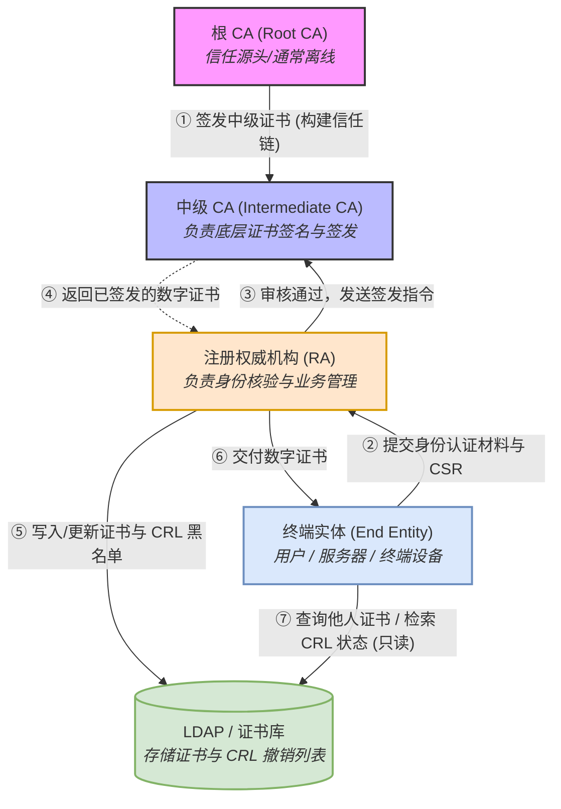

註冊權威
- 驗證證書（讀取 [[LDAP 證書庫]]）

在正規安全架構下，**RA 不應該具備對 LDAP 證書庫的直接寫入權限**：
1. **職責分離（SoD）**：RA 只負責「審核」，不負責「簽發與發布」。證書必須經過 CA 的私鑰簽署後才具備法律與安全效力。
    
2. **工作流程**：RA 完成審核後，發送 API / RPC 請求通知 **CA** -> CA 生成並私鑰簽署證書 -> **CA** 將簽署好的證書寫入 LDAP 證書庫。

風險隔離 - 減低攻擊面

## 相關
- [[CA - Cert Authority]]
- [[LDAP 證書庫]]
- [[CRL - 證書黑名單]]
- [[PKI 公鑰基礎設施]]
- [[RBAC 模型 Role-Based Access Control]]
    