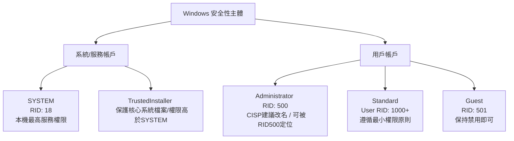

# Windows 系統帳戶體系與安全性解析

在 Windows 作業系統中，帳戶（Account）與安全性主體（Security Principal）決定了存取控制（Access Control）的邊界。以下為系統常見用戶、服務帳號的詳細解析、攻防實務視角與 CISP 考試重點。

- [[SID 與 RID]]
- [[SYSTEM]]
- [[Administrator]]
- [[Standard User]]
- [[Guest]]
- [[TrustedInstaller]]

## 📊 Windows 關鍵帳戶特性對比表

| 帳戶名稱                       | RID / SID   | 能否改名？ | 能否刪除？ | 能否直接登入？ | 預設狀態 | 實務加固與 CISP 對應策略                                             |
| -------------------------- | ----------- | ----- | ----- | ------- | ---- | ----------------------------------------------------------- |
| **SYSTEM**                 | `S-1-5-18`  | ❌     | ❌     | ❌       | 始終啟用 | 審查高權限服務；不可登入                                                |
| **Administrator** 內建管理員 | RID `500`   | ✅     | ❌     | ✅       | 預設停用 | **CISP**：重命名 + 停用；  **實務**：靠強密碼/MFA，單純改名可被 RID 500 繞過 |
| **Standard User**          | RID `1000+` | ✅     | ✅     | ✅       | 依需求  | 日常操作使用，遵循最小權限原則                                             |
| **Guest**                  | RID `501`   | ✅     | ❌     | ⚠️(預設否) | 預設停用 | **保持停用**（改名意義不大，因已被禁用）                                      |

## 相關
- [[Access Control 存取控制總覽 (MOC)]]
- [[Kerberos 協議]]
- [[Linux Setting files]]
