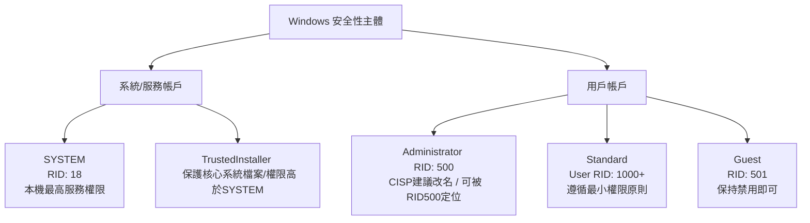

# Windows 系統帳戶體系與安全性解析

在 Windows 作業系統中，帳戶（Account）與安全性主體（Security Principal）決定了存取控制（Access Control）的邊界。以下為系統常見用戶、服務帳號的詳細解析、攻防實務視角與 CISP 考試重點。

Terms: 
- **SID**（Security Identifier，安全標識符）
	- 全局**唯一**的身份證字號
- **RID**（Relative Identifier，相對標識符）
	- 身份證字號的**最後末尾編號**

Example:

|                     | **SID**                                      | **RID**  |
| ------------------- | -------------------------------------------- | -------- |
| **SYSTEM**          | S-1-5-18                                     | **18**   |
| **LOCAL SERVICE**   | S-1-5-19                                     | **19**   |
| **NETWORK SERVICE** | S-1-5-20                                     | **20**   |
| **內建管理員**           | S-1-5-21-3622413455-3362034362-30311821-500  | **500**  |
| **標準用戶**            | S-1-5-21-3623811015-3361044348-30300820-1004 | **1004** |
| **GUEST**           | S-1-5-21-3281684619-24827881742-8347834-501  | **501**  |

---

## 1. SYSTEM (本地系統帳戶 / LocalSystem)

* **類型**：內建系統服務帳戶 (Built-in Security Principal)
* **SID**：`S-1-5-18`
* **屬性**：
	* **改名**：❌ 不可修改名稱
	* **刪除**：❌ 不可刪除
	* **登入**：❌ **不允許互動式登入**（無法在 UI 畫面輸入密碼登入桌面）
	* **狀態**：始終啟用 (Always Enabled)
	
* **權限與特性**：
	* 擁有本機作業系統的**最高級別權限**（權限高於 Administrator）。
	* 負責執行 Windows 核心服務、驅動程式與系統級背景作業。
	* 可獲取大多數檔案與註冊表機碼的完全控制權（若遇到 `TrustedInstaller` 所有權保護，須先 Take Ownership）。
	* 在網域 (Active Directory) 環境中，SYSTEM 存取跨機網絡資源時，會映射為該台電腦的電腦帳號（`COMPUTERNAME$`）。
	
* **加固建議**：
	* 限制並審查以 SYSTEM 權限運行的第三方服務（遵循最小權限原則）。

---

## 2. Administrator (內建系統管理員)

* **類型**：內建管理員帳戶 (Built-in Administrator)
* **RID**：`500` (固定格式如 `S-1-5-21-...-500`，尾號為 `500`)
* **屬性**：
	* **改名**：✅ **可修改名稱**
	* **刪除**：❌ 不可刪除
	* **登入**：✅ 可互動式登入
	* **狀態**：可啟用 / 可停用（預設多為停用）
	
* **權限與特性**：
	* 對本機電腦擁有完整的管理權限（可管理用戶、安裝軟體、修改系統設定）。
	* **受 UAC (使用者帳戶控制) 影響**：預設情況下，常規操作仍以過濾後的中權限令牌（Token）執行，觸發管理任務時需提升權限。
	
* **加固建議**：
	* 方案一 簡單防禦：
		* 重命名
		- 但不能禁用所有 Administrator，要不就走方案二
	- 方案二 完全防禦：
		- 創**全新的一般標準用戶帳號**（例如：`SysAdmin_Ops`, RID: `1000+`），並將其加入`Administrators` 群組成為 **自訂管理員**
		- 禁用原生的內建 Administrator
	
- **重命名爭議**：
	* **CISP 考試視角（「建議重命名」的原因）**：
		1. 屬於「縱深防禦（Defense in Depth）」中的基礎加固項目。
		2. 能有效阻擋最初級的「盲目式全網自動化 RDP/SSH 暴力破解腳本」（Script Kiddies）。
	* **實務視角（「重命名意義不大」的原因）**：
		1. **SID 機制暴露**：Windows 內部透過 SID/RID 識別用戶，黑客可使用 PowerShell 或 `mimikatz` 等工具直接查詢 **RID 500**，瞬間找出改名後的帳號。
		2. **對內網滲透無效**：一旦黑客突破外圍進入內網，可透過 SAM 資料庫或 RPC 枚舉解析出真正的管理員名稱。
		3. **運維成本**：多台伺服器隨機改名會增加自動化腳本維護的困難度。

---

## 3. Standard User (標準用戶 / 一般用戶)

* **類型**：手動創建或網域指派的普通帳戶（屬於 `Users` 組）
* **RID**：`1000+`
* **屬性**：
	* **改名**：✅ 可修改名稱
	* **刪除**：✅ **可刪除**（非內建保護帳戶）
	* **登入**：✅ 可互動式登入
	* **狀態**：可啟用 / 可停用
	
* **權限與特性**：
	* 僅能存取與修改該用戶自己的個人資料夾（`C:\Users\xxx\`）。
	* 無法修改系統全局設定、無法安裝影響全系統的軟體、無法存取其他用戶的私人檔案。
	* 執行需要管理權限的操作時，會跳出 UAC 提示，要求輸入管理員憑據。
	
* **加固建議**：
	* **日常運維**：管理員平時應使用標準用戶身份登入進行日常操作，僅在必要時透過 `Run as administrator`（以管理員身份運行）提升權限。

---

## 4. Guest (來賓帳戶)

* **類型**：內建來賓帳戶 (Built-in Guest)
* **RID**：`501` (固定格式如 `S-1-5-21-...-501`)
* **屬性**：
	* **改名**：✅ **可修改名稱**
	* **刪除**：❌ 不可刪除
	* **登入**：✅ 理論上可登入（**預設為禁用**）
	* **狀態**：可啟用 / 可停用
	
* **權限與特性**：
	* 權限極低，屬於 `Guests` 組。
	* 無法安裝軟體、無法變更系統設定、無法存取其他用戶的檔案。
	
* **加固建議**：
	* 保持 **禁用 (Disabled)** 
	
* **重命名爭議**：
	* **實務視角（「意義不大」的原因）**：Guest 帳戶預設即為禁用（Disabled）狀態。只要維持停用，改不改名完全不影響安全性。

---

## 5. [補充] TrustedInstaller (Windows 模組安裝程式)

* **類型**：Windows 服務主體 (Service SID)
* **SID**：`S-1-5-80-956008885-3418522649-1831038044-1853292631-227147846`
* **說明**：
* 自 Windows Vista 起引進，專門用於保護核心系統檔案（如 `C:\Windows\System32` 下的檔案）。
* **權限層級高於 SYSTEM**：即使是 SYSTEM 帳戶，預設也無法直接修改或刪除被 `TrustedInstaller` 保護的系統檔案。

---

## 📊 Windows 關鍵帳戶特性對比表

| 帳戶名稱                       | RID / SID   | 能否改名？ | 能否刪除？ | 能否直接登入？ | 預設狀態 | 實務加固與 CISP 對應策略                                             |
| -------------------------- | ----------- | ----- | ----- | ------- | ---- | ----------------------------------------------------------- |
| **SYSTEM**                 | `S-1-5-18`  | ❌     | ❌     | ❌       | 始終啟用 | 審查高權限服務；不可登入                                                |
| **Administrator** 內建管理員 | RID `500`   | ✅     | ❌     | ✅       | 預設停用 | **CISP**：重命名 + 停用；  **實務**：靠強密碼/MFA，單純改名可被 RID 500 繞過 |
| **Standard User**          | RID `1000+` | ✅     | ✅     | ✅       | 依需求  | 日常操作使用，遵循最小權限原則                                             |
| **Guest**                  | RID `501`   | ✅     | ❌     | ⚠️(預設否) | 預設停用 | **保持停用**（改名意義不大，因已被禁用）                                      |

