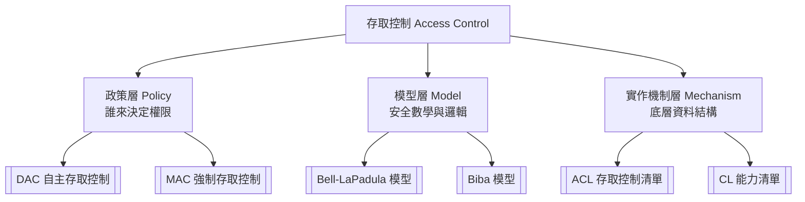

# 存取控制 (Access Control) 知識地圖

## 🗺️ 架構總覽 (Architecture)

---

## 🏛️ 1. 政策層 (Policy Layer)

*決定權限管理的哲學與歸屬*

- [[DAC 自主存取控制]]
- [[MAC 強制存取控制]]
- [[RBAC 模型 Role-Based Access Control]]

---

## 📐 2. 模型層 (Model Layer)

*MAC 政策底下的具體安全數學模型與規則*

- [[Bell-LaPadula 模型]]
- [[Biba 模型]]

---

## ⚙️ 3. 實作機制層 (Mechanism Layer)

*落實權限的底層資料結構與視角*

- [[ACL (Access Control List 存取控制清單)]]
- [[CL (Capability List 能力清單)]]
- [[ACL vs CL]]

---

* **Tags**: `#sec/access-control` `#moc`

## 相關
- [[Windows 系統用戶]]
- [[TCSEC]]
- [[信息安全 - 要素]]
